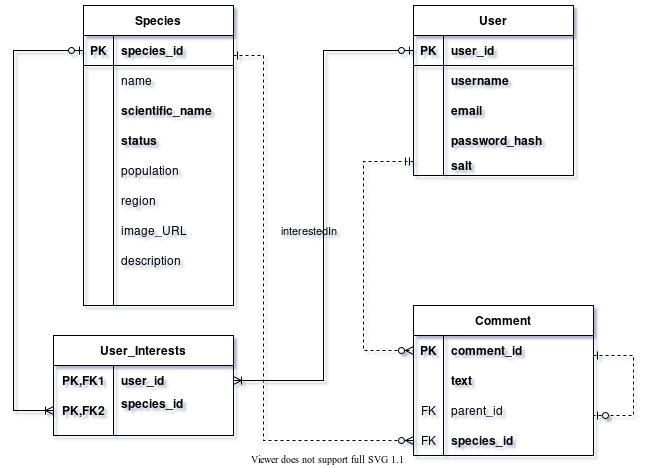

#### Creator - Meer Piyush Shah

This simple website aims to spread awareness about the severity of damage caused due to </br>
habitat destruction and climate change. And in the future, act as a forum to </br>
discuss solutions to protect each species.

#### URL:
https://extinct-or-alive.herokuapp.com/

#### Development Tools and Packages:
* Editor - [Atom](https://atom.io/)
* Browser - [Firefox](https://www.mozilla.org/en-US/firefox/new/)
* [Node.js](https://nodejs.org/en/) Packages:
  * [Express.js](https://expressjs.com/)
  * [Passport.js](https://www.passportjs.org/)
  * For an exhaustive list, refer the package.json file.

#### Project ER Diagram:
;

#### API / Data Sources:
* [GBIF](https://www.gbif.org/) | Global Biodiversity Information Facility
* [IUCN Red List](https://apiv3.iucnredlist.org/api/v3/docs) (Manual download, due to pending approval)
* [Wikimedia](https://api.wikimedia.org/)

#### Code snippet of API interaction (From utils/restUtil.js):
```
const GBIF_BASE = "https://api.gbif.org/v1/occurrence/";
const GBIF_PARAMS = "&limit=1";
axios.get(GBIF_BASE+'search?scientific_name='+speciesDetails.scientific_name+
          GBIF_PARAMS)
     .then ...
```

#### Credits:
* FrontEnd Template - [HTML5 Up](https://html5up.net/story)
* Homepage Video - [BBC Earth](https://www.bbcearth.com/shows/serengeti-ii)
* Logo - [Tree Favicon](https://www.favicon.cc/?action=icon&file_id=795443)
* Title Font - [Twiggy](https://www.dafont.com/twiggy.font)
* Icons - [FlatIcon](https://www.flaticon.com/authors/kiranshastry)
* Of course, the almighty [StackOverflow](https://stackoverflow.com/)

#### Reference and Tutorials:
* Node and Express - [FreeCodeCamp](https://www.youtube.com/watch?v=Oe421EPjeBE)
* Passport.js - [FreeCodeCamp](https://www.youtube.com/watch?v=F-sFp_AvHc8)
* FrontEnd Reference - [MDN](https://developer.mozilla.org/en-US/docs/Learn)
